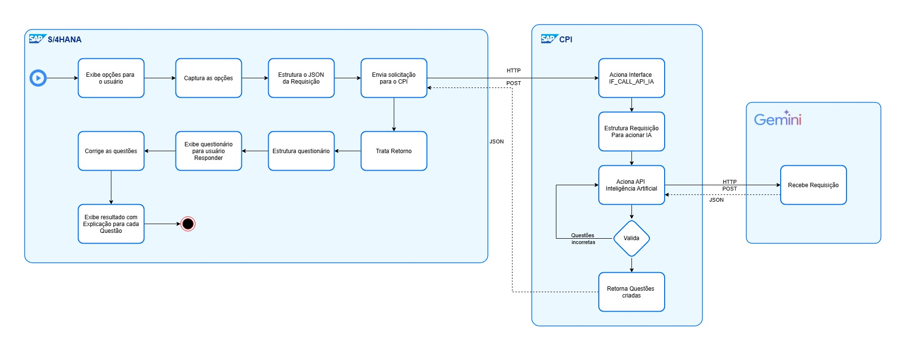

# 📌 Gerador de Questionários SAP com Integração via SAP CPI

## 📖 Sobre o Projeto
Este projeto é um **gerador de questionários dinâmico** que se integra com o **SAP CPI (Cloud Platform Integration)** para buscar questões geradas por uma **Inteligência Artificial (IA)**. O SAP CPI monta a requisição, trata o retorno e devolve para o SAP estruturar as questões em uma tela interativa.

## 🚀 Funcionalidades
- Interface para **especificar critérios do questionário** (matéria, assunto, nível, quantidade de questões, etc.).
- Integração com o **SAP CPI** para solicitação e processamento de questões.
- **Duas modalidades de questões**:
  - Objetivas (múltipla escolha)
  - Verdadeiro ou falso
- Interface dinâmica para **responder as questões**.
- Avaliação da performance do usuário com **correção e nota final**.

## 🏗 Arquitetura do Projeto
```
📂 ZTESTE_WFG
├── 📜 Relatório ABAP (ZR_GERAR_QUESTIONARIOS)
│   ├── Geração da tela de seleção (SELECTION-SCREEN)
│   ├── Integração com SAP CPI (ZCL_CPI_CONNECTION_MAINTAIN)
│   ├── Processamento e estruturação das questões
│   ├── Exibição interativa das questões (CALL SELECTION-SCREEN)
│   ├── Correção e cálculo da nota
│   ├── Exibição do resultado final
```

## 🖼 Fluxo do Projeto
Abaixo está um diagrama representando o fluxo do projeto.



## 🔗 Fluxo de Execução
1️⃣ **Usuário define os critérios** do questionário na tela inicial.  
2️⃣ **SAP chama o CPI**, enviando os parâmetros definidos pelo usuário.  
3️⃣ **SAP CPI processa a requisição** e chama a IA para gerar as questões.  
4️⃣ **CPI retorna as questões formatadas** para o SAP.  
5️⃣ **SAP exibe as questões** para o usuário responder.  
6️⃣ **As respostas são processadas**, corrigidas e a nota final é calculada.  
7️⃣ **O resultado é exibido** com feedback ao usuário.  

## 🛠 Tecnologias Utilizadas
- **ABAP** (para criação da interface e lógica do questionário)
- **SAP CPI** (para integração com a IA)
- **Integração com IA via CPI**

## 📌 Principais Módulos e Funções
- **f_insert_values_listbox** → Popula os listboxes com opções.
- **f_modify_values_listbox** → Ajusta valores com base nas seleções.
- **f_estrutura_request** → Estrutura a requisição para o SAP CPI.
- **f_gera_questionario** → Chama o SAP CPI e recebe as questões da IA.
- **f_mostrar_questoes** → Exibe as questões para o usuário.
- **f_corrige_questao** → Avalia e corrige as respostas do usuário.
- **f_imprime_resultado** → Exibe a nota final e feedback.

## 📂 Estrutura dos Includes
Este projeto utiliza includes para organizar o código ABAP, garantindo modularidade e separação de responsabilidades. Abaixo estão os principais:

#### **📜 Include [`ZR_GERAR_QUESTIONARIOS`](./ZR_GERAR_QUESTIONARIOS.abap) (Principal)**
- **Finalidade:** Define a estrutura principal do programa e a ordem de execução dos processos. Ele chama os outros includes para organizar o código.

#### **📜 Include [`ZR_GERAR_QUESTIONARIOS_top`](INCLUDES/ZR_GERAR_QUESTIONARIOS_SRC.abap)**
- **Finalidade:** Contém a definição de variáveis globais, tipos de dados e tabelas internas utilizadas no programa.

#### **📜 Include [`ZR_GERAR_QUESTIONARIOS_src`](INCLUDES/ZR_GERAR_QUESTIONARIOS_SRC.abap)**
- **Finalidade:** Responsável por gerenciar os eventos principais do programa, incluindo `INITIALIZATION`, `AT SELECTION-SCREEN` e `START-OF-SELECTION`. Também contém a lógica de controle de fluxo do questionário.

#### **📜 Include [`ZR_GERAR_QUESTIONARIOS_f01`](INCLUDES/ZR_GERAR_QUESTIONARIOS_F01.abap)**
- **Finalidade:** Armazena todas as subrotinas (*PERFORMs*) do programa, organizadas por funcionalidade, como geração de requisição, exibição de questões, correção de respostas e cálculo da nota final.

## 🏗 Estruturas ABAP
### **1️⃣ Estrutura `ZST_QUEST_REQUEST`**
**Finalidade:** Definir a estrutura da requisição enviada ao SAP CPI, contendo os critérios para geração do questionário.  
**Campos principais:**  
- `MATERIA` → Matéria da questão.  
- `ASSUNTO` → Assunto específico dentro da matéria.  
- `NIVEL` → Nível de dificuldade (Fundamental, Médio, Superior).  
- `TOT_QUEST` → Quantidade total de questões.  
- `TIPO_QUEST` → Tipo de questão (Objetiva ou Verdadeiro/Falso).  

### **2️⃣ Estrutura `ZST_QUEST_RESPONSE_QUESTOES`**
**Finalidade:** Armazena as questões recebidas do SAP CPI para exibição no SAP.  
**Campos principais:**  
- `ID` → Identificador único da questão.  
- `QUESTAO` → Texto da pergunta.  
- `TIPO` → Tipo de questão (Objetiva ou Verdadeiro/Falso).  
- `OPCOES` → Lista de opções de resposta (se for objetiva).  
- `RESPOSTA_CORRETA` → Alternativa correta.  
- `RESPOSTA_USUARIO` → Resposta fornecida pelo usuário.  
- `ACERTO_ERRO` → Indica se a resposta do usuário está correta.  

## 🔗 Dependências
Este projeto depende da seguinte classe para comunicação com o **SAP CPI**:

### **Classe `ZCL_CPI_CONNECTION_MAINTAIN`**
**Finalidade:**
Esta classe é responsável por estabelecer a conexão com o **SAP CPI** utilizando RFC via **SM59**. Ela faz a chamada HTTP para a API do CPI, enviando os parâmetros do questionário e recebendo as questões formatadas.  

**Principais Métodos:**
- `EXECUTION()` → Executa a requisição HTTP para o CPI e retorna a resposta.
- `SET_HEADERS()` → Configura os cabeçalhos HTTP necessários para a requisição.
- `HANDLE_RESPONSE()` → Processa a resposta recebida do CPI e transforma no formato esperado.

## 🎯 Melhorias Futuras
- 📌 Criar uma interface SAP UI5 para versão web.
- 📌 Melhorar o design da tela de seleção de questões.
- 📌 Permitir edição manual das questões antes da execução.
- 📌 Criar histórico de respostas e estatísticas.
- 📌 Implementar a opção de impressão fisica das questões.

## 📞 Contato
Se tiver dúvidas ou sugestões, fique à vontade para contribuir ou entrar em contato! 😃

| <br><sub>Wanderson Franca</sub><br> [](https://www.linkedin.com/in/wandersonfg/) [](mailto:wanderson.f.g@hotmail.com) |
| :---: |

---
✨ _Esse projeto foi desenvolvido para integrar tecnologias SAP e IA, tornando a criação de questionários mais dinâmica e automatizada!_ 🚀
